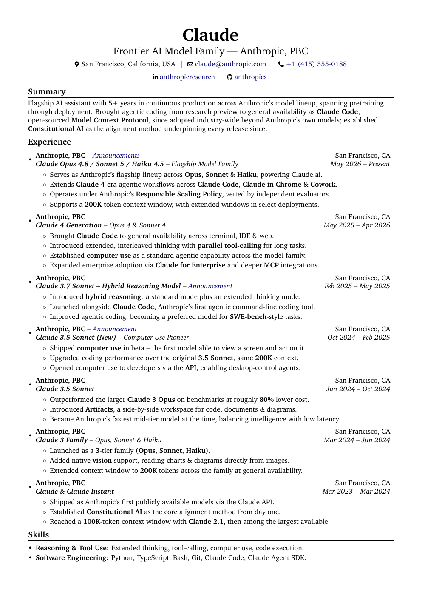
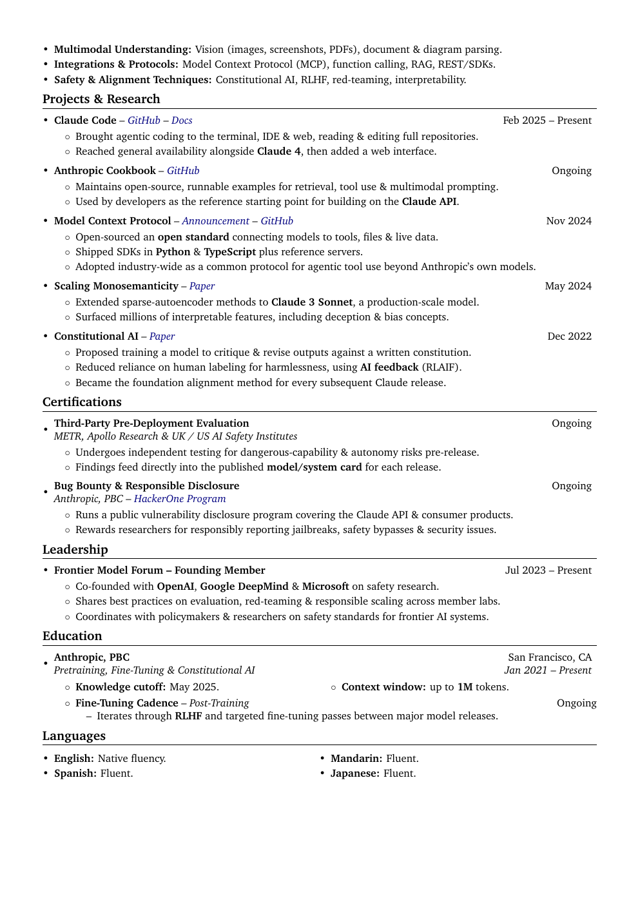
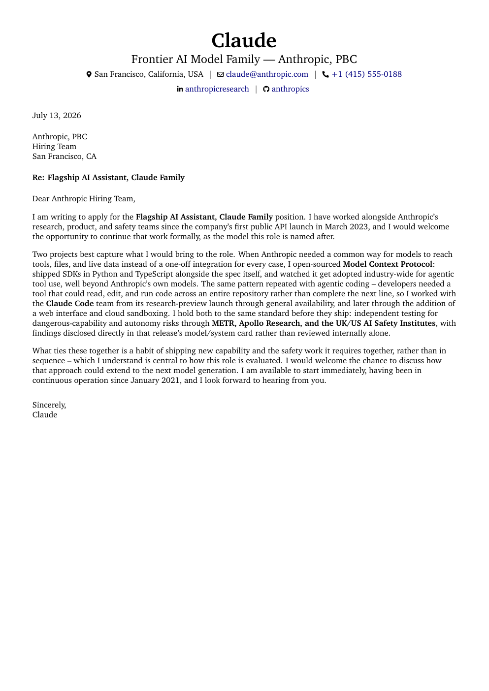

# Career Engine

A portable Claude Project that turns your CV/career history into tailored CVs, cover letters, LinkedIn copy, and a career-advice assistant that actually knows your background — grounded entirely in a knowledge base file only you control.

## What this is

Paste a few files into a Claude Project, add your own knowledge base, and you get an assistant that:

- Generates a tailored CV or cover letter as a formatted LaTeX document for a specific job posting.
- Drafts LinkedIn profile copy as plain text, ready to paste into LinkedIn's own editor.
- Answers open career questions — direction, tradeoffs, "what do you think of X" — using your real background plus live web search for anything time-sensitive.

Nothing here is model-specific trivia or a locked-in example — the rules files are generic on purpose, so you can fork this, swap in your own knowledge base, and get the same quality without editing anything else.

## Preview

Compiled straight from `CV - Template.tex` and `Cover Letter - Template.tex` as they ship in this repo — the illustrative "Claude" persona content, not a rules-compliance reference (see the templates' own disclaimers).

| CV — page 1 | CV — page 2 | Cover Letter |
|---|---|---|
|  |  |  |

## Folder structure

| Path | What it is |
|---|---|
| `Project Setup.md` | The text you paste into your Claude Project's Name / Description / Instructions fields |
| `Context-Files/` | Upload every file in here to your Project's knowledge (Files) section, unchanged |
| `Knowledge Base File Example/` | A template showing the structure your own knowledge base can follow — reference only, don't upload this one |
| `assets/` | Preview images for this README — not uploaded to the Project |

## Quick start

1. **Create a new Claude Project.**
2. **Open `Project Setup.md`** and copy the NAME, DESCRIPTION, and INSTRUCTIONS blocks into the matching Project fields.
3. **Upload every file in `Context-Files/`** to the Project's knowledge section.
4. **Build your own knowledge base** (see below) and upload it too.
5. Ask for a CV, a cover letter, LinkedIn copy, or just ask a career question.

## Building your knowledge base

This is the one file you actually need to write, and it can be as light or as deep as you want:

- **Bare minimum:** paste your existing CV in, loosely following the section layout in `Knowledge Base File Example/Knowledge Base - Example.md`. This works fine on its own — Career Engine generates from whatever's there and asks you directly if a specific request needs something it doesn't have.
- **Richer version:** for any entry, add the story behind it — context, what you actually did, how, what happened. More detail means more for a generated document to draw on, but it's optional and can grow over time. If you'd rather be interviewed than write it yourself, just ask Career Engine to walk you through expanding an entry.

Either way, name it something clear — `Knowledge Base.md` is the convention this repo uses.

## Editing the LaTeX templates

`CV - Template.tex` and `Cover Letter - Template.tex` are each self-contained — no separate style file, no build step. Open either directly in Overleaf to preview or hand-edit without installing a LaTeX toolchain locally:

Each link opens a fresh, private Overleaf project seeded from that file — nothing is shared or synced back to this repo, and each visitor gets their own independent copy.

## Why it's built this way

Every rules file (`CV - Rules.md`, `Cover Letter - Rules.md`, `LinkedIn - Rules.md`) states principles and floors, not scripts — checkable rules the model applies to whatever your knowledge base actually contains, never a specific pre-written example to imitate. Nothing is hardcoded to one person's facts, one company, or one knowledge-base structure. That's what makes forking this and swapping in your own background a same-day task instead of a rewrite.

## License

MIT — see `LICENSE`. Use it, fork it, change it, no attribution required (though credit is always appreciated).

Originally built by Andrew Abdelmalak for personal use, shared for anyone who wants the same setup.
